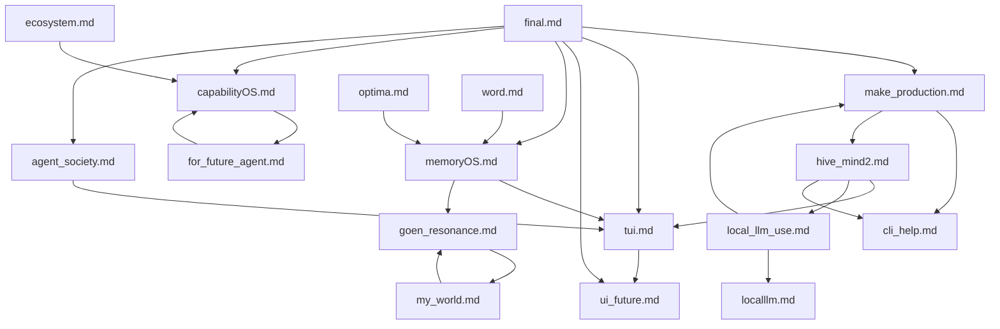

# Lowercase Source Graph

This maps the lowercase-starting docs in `docs/`. Most of these are raw or semi-raw source notes rather than canonical implementation specs. Do not rename them yet; use this graph to route reading and extraction.

## Graph

## Canonicalization Policy

- Lowercase docs are source material, captured conversations, or draft thinking.
- Uppercase docs are canonical docs for implementation and agent onboarding.
- New implementation decisions should be distilled into uppercase canonical docs, then traced back here with source references.
- Large lowercase docs should be read through `docs/split/**` mirrors first.

## Document Map

| File | Type | Primary VG nodes | What to use it for | Canonical destination |
| --- | --- | --- | --- | --- |
| `final.md` | synthesis source | `VG-00`, `VG-01`, `VG-02`, `VG-03`, `VG-06` | Full Human-AI-Agent Operating Stack and component roles. | `NORTHSTAR.md`, `ROADMAP.md`, `VISION_GRAPH.md`. |
| `make_production.md` | production source | `VG-03`, `VG-04`, `VG-05`, `VG-13` | Installable `hive`, onboarding, provider/MCP/local runtime commands. | `TUI_HARNESS.md`, `PROVIDER_HARNESS_GUIDE.md`, future packaging spec. |
| `tui.md` | harness source | `VG-03`, `VG-04`, `VG-11` | Blackboard run folder, artifact protocol, wrapper CLI/TUI behavior. | `TUI_HARNESS.md`, Harness Runtime TODO. |
| `ui_future.md` | product/UX source | `VG-00`, `VG-03`, `VG-10` | Future Chatbot Harness, Agent Harness, visual product language. | API/UI roadmap, future Desktop spec. |
| `memoryOS.md` | large source vault | `VG-01`, `VG-10`, `VG-11`, `VG-12` | Conversation memory graph, parser ideas, desktop screens, implementation handoffs. | `MEMORYOS_MVP.md`, `EXPORT_PARSERS.md`, split mirror. |
| `capabilityOS.md` | product source | `VG-02`, `VG-04`, `VG-13` | Capability ontology, MCP/tool/workflow graph, SaaS/product implications. | Future CapabilityOS schema spec. |
| `agent_society.md` | research/product source | `VG-06`, `VG-00` | Agent profiles, feedback, peer review, routing/prompt mutation safety. | Future Agent Society schema spec. |
| `local_llm_use.md` | runtime source | `VG-05`, `VG-03`, `VG-04` | Local model choices, role routing, JSON schemas, benchmarks. | `LOCAL_LLM_WORKERS.md`, local runtime commands. |
| `localllm.md` | runtime source | `VG-05`, `VG-03` | Cheap-first local worker philosophy and task boundaries. | `LOCAL_LLM_WORKERS.md`. |
| `cli_help.md` | execution capture | `VG-04`, `VG-13` | Captured Claude/Gemini/Codex CLI command contracts. | `PROVIDER_HARNESS_GUIDE.md`. |
| `goen_resonance.md` | research source vault | `VG-07`, `VG-08`, `VG-09` | Dipeen, GoEN reverse translation, ontology plasticity, post-language interface. | Split mirror, future MPU-D0/D1 specs. |
| `my_world.md` | largest source vault | `VG-00`, `VG-07`, `VG-08`, `VG-09`, `VG-12` | Raw broad MyWorld/quantum/Dipeen/GoEN context and claim boundaries. | `MYWORLD_IDEA_EXCERPTS.md`, split mirror. |
| `ecosystem.md` | ecosystem source | `VG-00`, `VG-02`, `VG-06` | Broader world/market/identity/economy framing. | Future ecosystem/market design doc; not P0. |
| `for_future_agent.md` | future protocol source | `VG-02`, `VG-04`, `VG-06` | Capability modules, CMP-like protocol, future agent package layer. | CapabilityOS schema/workflow docs. |
| `optima.md` | storage/source strategy | `VG-01`, `VG-11`, `VG-12` | Source graph, claim graph, hot/warm/cold storage, discriminator role. | Schema/Audit/Search TODO. |
| `word.md` | lexicon source | `VG-00` through `VG-13` | Terminology, naming, layer vocabulary. | Keep as lexicon; cite from canonical docs. |
| `hive_mind2.md` | production hardening source | `VG-03`, `VG-04`, `VG-05`, `VG-06`, `VG-13` | Production-readiness gaps for `hive`: doctor, local setup, role policy, context packs, provider result schema, MemoryOS/CapabilityOS links, tests, install, audit. | `TODO.md` Production Hardening section, `TUI_HARNESS.md`, `PROVIDER_HARNESS_GUIDE.md`, future policy/context specs. |

## Read Order By Task

| Task | Read |
| --- | --- |
| Implement `hive`/TUI/provider flow | `make_production.md` -> `hive_mind2.md` -> `tui.md` -> `cli_help.md` -> `local_llm_use.md` |
| Implement MemoryOS graph/import/audit | `memoryOS.md` split index -> `optima.md` -> `word.md` |
| Implement local LLM workers | `local_llm_use.md` -> `localllm.md` -> `cli_help.md` |
| Plan CapabilityOS | `capabilityOS.md` -> `for_future_agent.md` -> `ecosystem.md` |
| Plan Agent Society | `agent_society.md` -> `final.md` -> `ui_future.md` |
| Research Dipeen/GoEN | `goen_resonance.md` split index -> `my_world.md` split index -> `word.md` |

## Extraction TODO

- Distill `capabilityOS.md` into `docs/CAPABILITYOS_SCHEMA.md`.
- Distill `agent_society.md` into `docs/AGENT_SOCIETY_SPEC.md`.
- Distill `optima.md` into `docs/STORAGE_STRATEGY.md`.
- Distill `word.md` into a stable glossary linked from all canonical docs.
- Keep `memoryOS.md`, `my_world.md`, and `goen_resonance.md` as source vaults, not active implementation docs.
