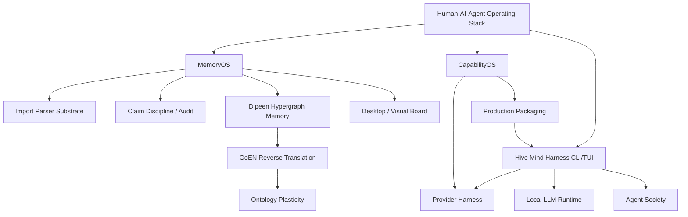

# Vision Graph

This file maps the current product/research vision to source documents and implementation work. Use it as the graph-like index before opening large source files.

## Graph

## Node Map

| ID | Vision node | Meaning | Primary sources | Current implementation / TODO |
| --- | --- | --- | --- | --- |
| VG-00 | Human-AI-Agent Operating Stack | Full workflow: human intent, deliberation, MemoryOS/CapabilityOS, agent handoff, execution, verification, feedback. | `final.md`, `NORTHSTAR.md`, `docs/split/my_world/part-017-mechanical-evolution-truth-seeking-intelligence.md` | `ROADMAP.md` phases 0.5-2.6; `TODO.md` Agent Harness, CapabilityOS, Agent Society. |
| VG-01 | MemoryOS | Private memory graph for decisions, claims, evidence, disagreements, project state, agent runs. | `memoryOS.md`, `NORTHSTAR.md`, `MEMORYOS_MVP.md`, `docs/split/memoryOS/index.md` | `memoryos/`, `memory/processed/nodes.jsonl`, `ontology/edges.jsonl`; `TODO.md` Parser, Schema, Extraction, Audit. |
| VG-02 | CapabilityOS | Capability/workflow/tool/provider graph for choosing how work should be done. | `capabilityOS.md`, `final.md`, `for_future_agent.md`, `make_production.md` | `TODO.md` CapabilityOS; not yet implemented as storage. |
| VG-03 | `hive` Harness CLI/TUI | Operational blackboard that turns tasks into artifacts for agents/providers. | `tui.md`, `TUI_HARNESS.md`, `HIVE_WORKING_METHOD.md`, `make_production.md`, `hive_mind2.md`, `docs/split/memoryOS/part-008-external-agent.md` | `hivemind/hive.py`, `hivemind/harness.py`, `hivemind/tui.py`; `TODO.md` Now, Harness Runtime, and Production Hardening. |
| VG-04 | Provider Harness | Claude, Codex, Gemini, hosted APIs, and future providers behind one artifact protocol. | `PROVIDER_HARNESS_GUIDE.md`, `cli_help.md`, `PROVIDER_MODELS.md`, `make_production.md`, `hive_mind2.md` | `hive doctor`, `hive invoke`; `TODO.md` Harness Runtime, Agent Harness, and Production Hardening. |
| VG-05 | Local LLM Runtime | Cheap local workers for classify, extract, compress, summarize, draft, review. | `local_llm_use.md`, `localllm.md`, `LOCAL_LLM_WORKERS.md`, `LOCAL_LLM_INVENTORY.md`, `hive_mind2.md` | `hivemind/local_workers.py`, `hive local status/setup`; `TODO.md` Local LLM Workers and Production Hardening. |
| VG-06 | Agent Society | Observable agent profiles, reviews, feedback, routing proposals, prompt mutation proposals. | `agent_society.md`, `HIVE_WORKING_METHOD.md`, `final.md`, `hive_mind2.md`, `ROADMAP.md` phase 2.6 | `TODO.md` Agent Society and Production Hardening; not auto-adaptive yet. |
| VG-07 | Dipeen Hypergraph Memory | Externalized shared ontology/memory substrate for agents and research workflows. | `goen_resonance.md`, `my_world.md`, `docs/split/goen_resonance/part-003-dipeen-hypergraph-filesystem.md`, `docs/split/my_world/part-015-dipeen.md` | `ROADMAP.md` phase 5; `TODO.md` GoEN / Dipeen Research. |
| VG-08 | GoEN Reverse Translation | Convert natural language into claims, events, hyperedges, uncertainty, action policy, and ontology structures. | `goen_resonance.md`, `docs/split/goen_resonance/part-005-goen-reverse-translation.md`, `docs/split/my_world/part-016-goen.md` | `ROADMAP.md` phase 6; `TODO.md` Extraction Work and GoEN / Dipeen Research. |
| VG-09 | Ontology Plasticity | Graph operations that split, merge, retype, prune, and promote structures based on evidence and task pressure. | `goen_resonance.md`, `my_world.md`, `docs/split/goen_resonance/part-001-ontology-plasticity-agent.md`, `docs/split/my_world/part-003-autonomous-truth-seeking-architecture.md` | `ROADMAP.md` phase 7; `TODO.md` Schema Work and GoEN / Dipeen Research. |
| VG-10 | Desktop / Visual Board | Later cockpit: import center, ask memory, graph explorer, draft review, settings. | `memoryOS.md`, `ui_future.md`, `docs/image.png`, `docs/split/memoryOS/part-011-desktop-4.md` | Deferred until `hive` artifacts and review state are stable; `TODO.md` API And UI. |
| VG-11 | Import Parser Substrate | Official exports and local files become durable normalized nodes with provenance. | `memoryOS.md`, `EXPORT_PARSERS.md`, `MEMORYOS_MVP.md`, `docs/split/memoryOS/part-007-parser-and-mcp-workflow.md` | `../memoryOS/memoryos/cli.py`; `TODO.md` Parser Work. |
| VG-12 | Claim Discipline / Audit | Separate evidence-backed claims from speculative/unsupported claims, preserve disagreement and stale decisions. | `AGENTS.md`, `NORTHSTAR.md`, `ARCHITECTURE.md`, `MYWORLD_IDEA_EXCERPTS.md` | `memoryos audit`; `TODO.md` Audit Work and Schema Work. |
| VG-13 | Production Packaging | Installable local-first `hive` product wrapping MemoryOS, CapabilityOS, MCP, providers, and local runtime. | `make_production.md`, `hive_mind2.md`, `TUI_HARNESS.md`, `PROVIDER_HARNESS_GUIDE.md` | `hive init`, `hive doctor`, `hive local status/setup`; `TODO.md` Harness Runtime, Production Hardening, and Security/Product. |

## Source Families

| Family | Files | Use when |
| --- | --- | --- |
| Current execution | `TUI_HARNESS.md`, `PROVIDER_HARNESS_GUIDE.md`, `LOCAL_LLM_WORKERS.md`, `make_production.md`, `hive_mind2.md`, `cli_help.md` | Changing `hive`, provider invocation, onboarding, local workers. |
| Product direction | `final.md`, `capabilityOS.md`, `agent_society.md`, `ui_future.md`, `ecosystem.md`, `for_future_agent.md`, `optima.md` | Planning product architecture, future UI, workflow/capability maps. |
| Memory substrate | `memoryOS.md`, `MEMORYOS_MVP.md`, `EXPORT_PARSERS.md`, `ARCHITECTURE.md` | Changing import, graph, parser, audit, memory review. |
| Research substrate | `goen_resonance.md`, `my_world.md`, `MYWORLD_IDEA_EXCERPTS.md` | Reasoning about Dipeen, GoEN, ontology plasticity, claim boundaries. |
| Split mirrors | `docs/split/my_world/index.md`, `docs/split/memoryOS/index.md`, `docs/split/goen_resonance/index.md` | Finding a precise chunk from large raw source docs. |

## Implementation Rule

When adding a major TODO or design doc, attach at least one `VG-*` source tag. If no source tag fits, either add a new node here or mark the item as speculative.
